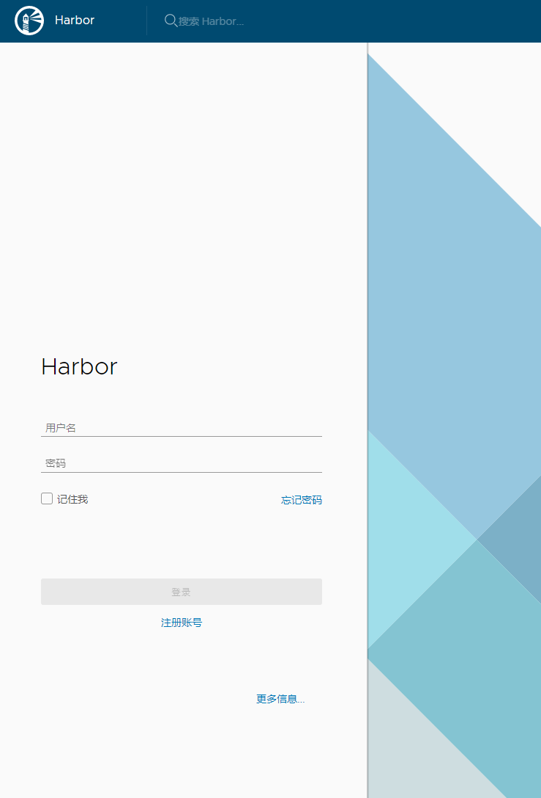
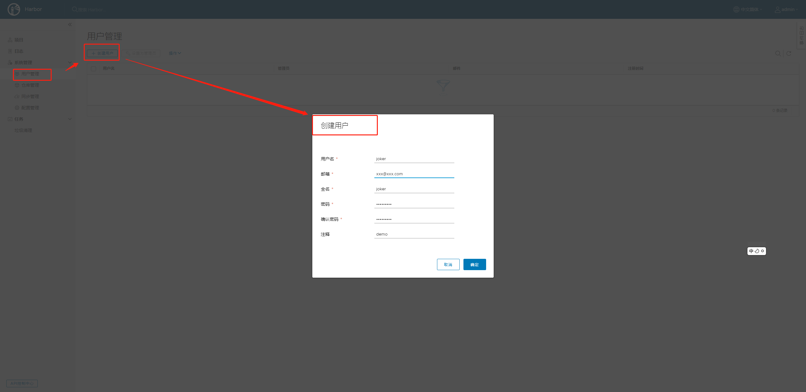
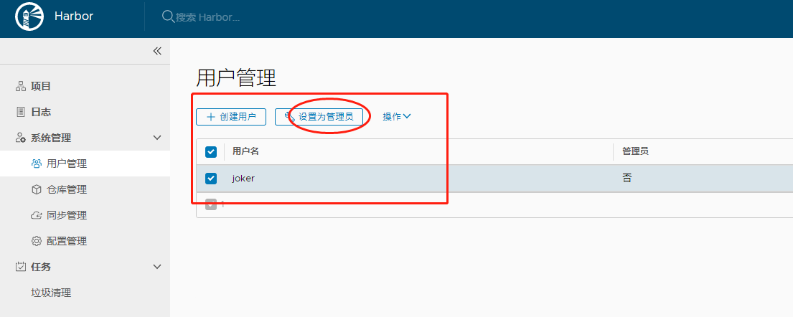
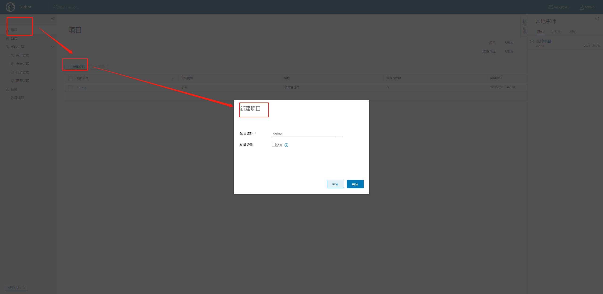
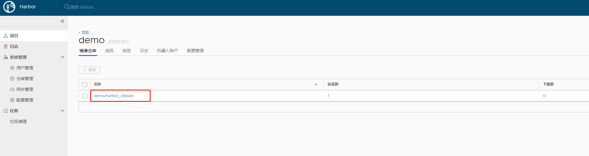

# Harbor部署教程

> 概述：harbor 是一个开源的企业级docker hub库 (类似gitlab),用于存放以及管理基础镜像，如 基础编译容器、基础运行容器

## 1.安装
> 默认安装在系统/opt目录下,需要root权限
~~~bash
$ cd /opt && wget https://storage.googleapis.com/harbor-releases/release-1.8.0/harbor-offline-installer-v1.8.0.tgz
$ cd /opt && tar xvf harbor-offline-installer-v1.8.0.tgz
$ cd /opt/harbor && mv harbor.yml harbor.yml.bak
$ cd /opt/harbor && wget https://raw.githubusercontent.com/Joker1222/Harbor-Deploy/main/harbor.yml 
$ cd /opt/ && curl -fsSL get.docker.com -o get-docker.sh && bash get-docker.sh --mirror Aliyun && \
curl -L https://github.com/docker/compose/releases/download/1.22.0/docker-compose-`uname -s`-`uname -m` -o /usr/local/bin/docker-compose
$ ./install.sh
$ echo "127.0.0.1 harbor.101.com" >> /etc/hosts
~~~

## 2.Harbor页面操作

**打开localhost:9010,登录Harbor,初始账号admin,密码Harbor123456**

**用户管理、创建用户并设置成管理员**

**项目、新建项目**

## 3.镜像上传下载

**Docker登录**
~~~bash
root@localhost:/opt/harbor# docker login 101-bytedance.harbor.com:9010
Username: joker
Password: 
WARNING! Your password will be stored unencrypted in /root/.docker/config.json.
Configure a credential helper to remove this warning. See
https://docs.docker.com/engine/reference/commandline/login/#credentials-store

Login Succeeded
~~~

**Push一个镜像**
~~~bash
$ echo "FROM debian" > Dockerfile && echo "RUN /bin/bash" >> Dockerfile #制作一个测试镜像
$ docker build -t="test_debian" . #生成镜像
$ docker tag test_debian harbor.101.com:9010/demo/harbor_debian:v0.0.1 #打上标签然后再push
$ docker push harbor.101.com:9010/demo/harbor_debian:v0.0.1 #push
~~~

**Pull**
~~~bash
$ docker pull harbor.101.com:9010/demo/harbor_debian:v0.0.1 #直接pull到本地
$ vim Dockerfile
FROM harbor.101.com:9010/demo/harbor_debian:v0.0.1  #也可以作为dockerfile的from使用
....
~~~